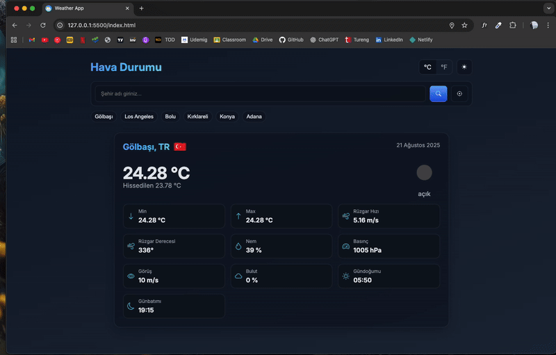

# 🌦️ Weather App

A modern web application where users can view the weather for their current location and also search for detailed weather information for any city.

## 🚀 Features

- 📍 Get weather data based on your current location

- 🔎 Search by city name

- 🌡️ Current temperature information

- ↕️ Minimum & Maximum temperature

- 💧 Humidity

- 🌬️ Wind speed

- 🔽 Pressure information

- ☁️ Weather forecast & icons

- 🎨 Modern design with HTML, SCSS, and JavaScript

- 📱 Responsive design (mobile, tablet, and desktop compatible)

## 🛠️ Technologies Used

- HTML5 – Structure

- SCSS (Sass) – Modern style and responsive design

- JavaScript (Vanilla JS) – Dynamic data and API integration

- OpenWeather API – Weather data

## 🌐 Live Demo 

https://app-weather01.netlify.app/

## 🖼️ ScreenShot

